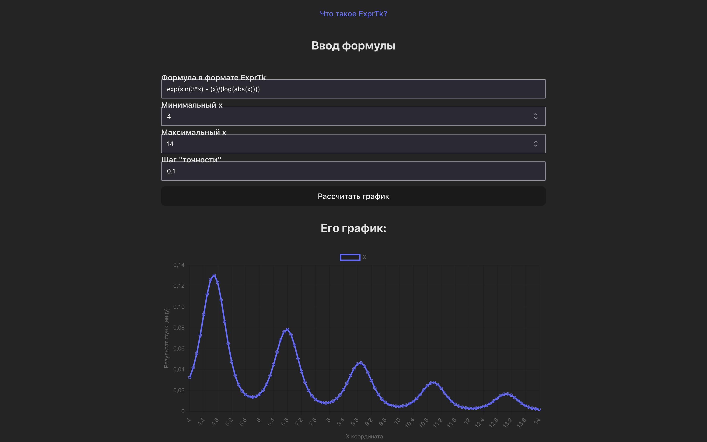

# D1
## Описание


 Представляет собой простой веб-сервер на C++ с использованием библиотеки Boost Asio и JSON, который принимает POST-запросы с математическими выражениями. Сервер обрабатывает запросы, вычисляет значения функции в заданном диапазоне и отправляет результат в формате JSON. Далее отправляет результат на веб где результат визуализируется.
 <p align="center" style="display: flex; justify-content: center;">
  
  
</p>

## Как запустить?
### C использованием Docker-compose

#### 1 Установить Docker
```bash
sudo add-apt-repository "deb [arch=amd64] https://download.docker.com/linux/ubuntu $(lsb_release -cs) stable"

sudo apt update
sudo apt install docker-ce

sudo usermod -aG docker $USER
```

### 2 Клонирование репозитория

Склонируйте этот репозиторий на свой компьютер:

``` bash
git clone <URL репозитория>
cd <название директории бекэнда>
```

### 2.1 Настройка для внешних соедений

``` bash
# Явно указать URL бекэнда
nvim ./frontend/src/calculator.ts

# Настройка Nginx
nvim ./frontend/nginx.conf
```

### 3 Запуск Docker-compose

``` bash
# Флаг -d нужен для запуска в "фоне"
docker-compose up -d
```


(Ниже указан деплой без использования Docker)
### Без использования Docker-compose

### 1. Установка зависимостей

	•	Boost (для работы с сетевыми соединениями) 
	•	JsonCpp (для работы с JSON)

#### Для установки на Ubuntu выполните:

``` bash
sudo apt update
sudo apt install libboost-all-dev libjsoncpp-dev
```

### 2. Клонирование репозитория

Склонируйте этот репозиторий на свой компьютер:

``` bash
git clone <URL репозитория>
cd <название директории бекэнда>
```

### 3. Компиляция проекта

Скомпилируйте код с помощью g++, указав необходимые библиотеки:

``` bash
g++ -std=c++11 main.cpp -o server -lboost_system -ljsoncpp -I/usr/include/jsoncpp -I./libs
```

### 4. Запуск сервера

Запустите скомпилированный сервер на указанном порту (по умолчанию используется порт 8088):

``` bash
./server
```

После запуска вы увидите сообщение о том, что сервер запущен.

### 5. Отправка запроса на сервер

Для отправки запроса с математическим выражением используйте HTTP-клиент (например, curl). Пример команды для запроса на сервер:

``` bash
curl -X POST -H "Content-Type: application/json" \
     -d '{"expression": "abs(-12*x) + 12312", "x_min": -10, "x_max": 10, "x_step": 1}' \
     http://localhost:800/api/
```

Ответ будет в формате JSON и содержит значения функции для каждого x в заданном диапазоне.

### 6* Подлкючение визуализации графиков
Для этого забилдим frontend и запустим локальный nginx сервер
### 6.1 Установка зависимостей
Установим Node.js и nginx
``` bash
sudo apt update
curl -fsSL https://deb.nodesource.com/setup_21.x | sudo -E bash -
sudo apt install -y nodejs
sudo apt install -y nginx
```

### 6.2 Переход к деректории проекта
``` bash
cd <название директории фронтэнда>
```
### 6.3 Скачивание зависимостей
``` bash
npm install
```
### 6.4 Билд проекта
``` bash
#vite - TS
npm run build
```
### 6.5 Создайте и настройте файл конфигурации Nginx
``` bash
sudo nano /etc/nginx/sites-available/d1
```
```nginx
server {
    listen 80;
    server_name <ваш домен или ip>;

    root /var/www/myapp; # Путь к папке с билдом
    index index.html;

    location / {
        try_files $uri $uri/ /index.html;
    }
}
```
**Cоздание ссылки на конфигурацию:**
``` bash
sudo ln -s /etc/nginx/sites-available/d1 /etc/nginx/sites-enabled/
```
**Перезапустите Nginx для применения настроек:**
``` bash
sudo systemctl restart nginx
```
### 6.6 Проверка работы
Перейдите по ip который вы указали в конфигурации nginx (<ваш домен или ip>)


## Технологии

	•	C++11 — основной язык программирования для бекэнда.
	•	Boost Asio — библиотека для работы с сетевыми соединениями.
	•	JsonCpp — библиотека для обработки JSON-формата данных.
	•	exprtk — библиотека для вычисления математических выражений.
    •	Vite — локальный сервер разработки
    •	TS — основной язык программирования для фронтэнда.
    •	Chart.js — библиотека для визуализации графиков.


#### Описание классов и модулей

	•	IRequestHandler — интерфейс для обработки запросов.
	•	CalculationRequestHandler — класс для обработки корректных POST-запросов с выражениями.
	•	ErrorRequestHandler — класс для обработки ошибок (например, если выражение не указано).
	•	HttpRequestParser — класс для разбора и обработки HTTP-запросов.
	•	WebServer — основной класс сервера, управляющий подключениями и запросами.

#### Пример использования

	1.	Компиляция и запуск сервера: следуйте инструкциям выше.
	2.	Отправка запроса: отправьте JSON-запрос с указанием выражения и параметров x_min, x_max, x_step.
	3.	Получение ответа: сервер вернет JSON-ответ с результатами вычисления для каждого значения x.
    4*.	Просмотр визуализирванного ответа

